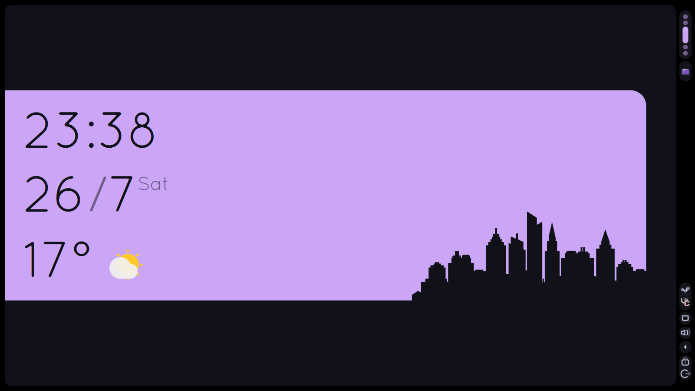

<div align="center">

# MyOS KDE

> [!NOTE]
> I haven't found a way to make a script to copy and paste the configuration files on an easy way, you can use GNU Stow so I would clone this repo on a hidden folder!

</div>

Base:              - Arch Linux

Kernel:            - Linux

Shell:             - zsh

DE:                - KDE Plasma

> [Catppuccin Mocha Mauve]
>

> [Catppuccin Latte Mauve]
>

#   Appearance


App Style:          Breeze 

App Style GTK:      Catpuccin-Mocha-Standard 

Plasma Style:       Utterly Round

Colors:             Catppuccin Mocha Mauve // Catppuccin Latte Mauve
```
git clone --depth=1 https://github.com/catppuccin/kde catppuccin-kde && cd catppuccin-kde
./install.sh
```

Window decorations: Breeze (Dissabled)

Fonts:
    
    General:        NotoSans Nerd             10pt
    
    Fixed Width:    NotoSansM Nerd 8pt
    
    Small:          NotoSans Nerd             8pt
    
    Toolbar:        NotoSans Nerd             10pt
    
    Menu            NotoSans Nerd             10pt
    
    Window Title:   NotoSans Nerd             10pt
    
Icons:              Tela Purple Dark (https://store.kde.org/p/1279924)

Cursors:            BreezeX Light (https://store.kde.org/p/1640746)

System Sounds:      Ocean

Splashscreen:       Catppuccin Mocha Mauve

SDDM:               Catppuccin Mocha

Shell:              ohmyzsh! "bira"

   - Install:
```
sh -c "$(curl -fsSL https://raw.githubusercontent.com/ohmyzsh/ohmyzsh/master/tools/install.sh)"
```

#   Aplications

Web Browser:        Zen Browser

File Manager:       Dolphin

File Archiver:      Ark

Terminal emulator:  Kitty

Text Editor:        Kate / nano

Office:             OnlyOffice

PDF:                Okular

Image Viewer:       GwenView

Music:              Elisa

Video:              Haruna

Map:                Google Maps

#   Widgets

-Redmi Clock
-Ginti
-Wallpaper Effects
-Panel Colorizer
-Plasmusic Toolbar

#               Build

#   Pacman
```
sudo pacman -S --needed ark audiotube base-devel btop bzip2 curl deskflow discord e2fsprogs elisa fakeroot fastfetch ffmpeg ffmpeg4.4 flatpak gimp git gst-plugin-pipewire gst-plugins-bad gst-plugins-bad-libs gst-plugins-base gst-plugins-base-libs gst-plugins-good gst-plugins-ugly gstreamer gwenview gzip haruna isoimagewriter kalk kdeconnect kdenlive kitty krita ktorrent linux-headers nano noto-fonts noto-fonts-cjk noto-fonts-emoji noto-fonts-extra ntfs-3g okular partitionmanager pipewire-alsa pipewire-jack pipewire-pulse qemu-full spectacle steam unrar unzip virt-manager wget wireplumber yt-dlp zsh

    - git clone https://aur.archlinux.org/paru-bin.git
    - cd paru-bin/
    - makepkg -si
paru -Syu

paru -S --needed brave-bin gradia onlyoffice-bin protonplus vesktop-bin zen-browser-bin

paru -R htop #vim

Debian: 

apt install ark btop bzip2 curl deskflow e2fsprogs elisa falkon fakeroot fastfetch ffmpeg flatpak gimp git gwenview gzip haruna isoimagewriter kalk kdeconnect kdenlive kitty krita ktorrent linux-headers-amd64 nano fonts-noto fonts-noto-cjk fonts-noto-cjk-extra fonts-noto-color-emoji fonts-noto-extra ntfs-3g okular partitionmanager pipewire-alsa pipewire-jack pipewire-pulse qemu-system qemu-user kde-spectacle unrar-free unzip virt-manager wget wireplumber yt-dlp zsh

flatpak install com.brave.Browser com.discordapp.Discord org.onlyoffice.desktopeditors com.vysp3r.ProtonPlus com.valvesoftware.Steam  dev.vencord.Vesktop app.zen_browser.zen
```

#   flatpak
```
flatpak install flathub com.github.tchx84.Flatseal com.usebottles.bottles com.obsproject.Studio com.obsproject.Studio.Plugin.AitumMultistream com.obsproject.Studio.Plugin.GStreamerVaapi com.obsproject.Studio.Plugin.Gstreamer com.obsproject.Studio.Plugin.OBSVkCapture com.rustdesk.RustDesk io.github.shiftey.Desktop  org.prismlauncher.PrismLauncher org.signal.Signal
```
